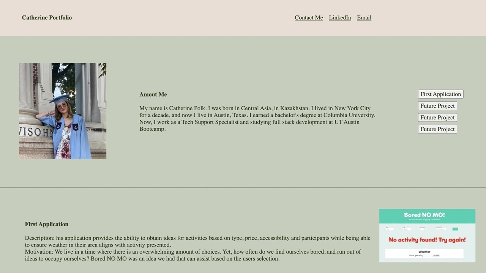

Module 2 Challenge

My motivation was to create a professional portfolio for my future job search in the tech industry. 

Why did you build this project? (Note: the answer is not "Because it was a homework assignment.")

I built this project to demonstrate my skills, present myself in the professional world, and find a job in the future. 

The professional portfolio solves multiple problems, including job search; it helps to demonstrate skills and talents before even meeting an employer. 

While creating my professional portfolio, I learned how to use wireframing, HTML, and CSS code. 

Minimalistic styling and simple links and buttons of my professional portfolio make it look friendly and easy to navigate. 

URL link: https://catpolk.github.io/catherine-polk-portfolio/
Github link: https://github.com/catpolk/catherine-polk-portfolio

